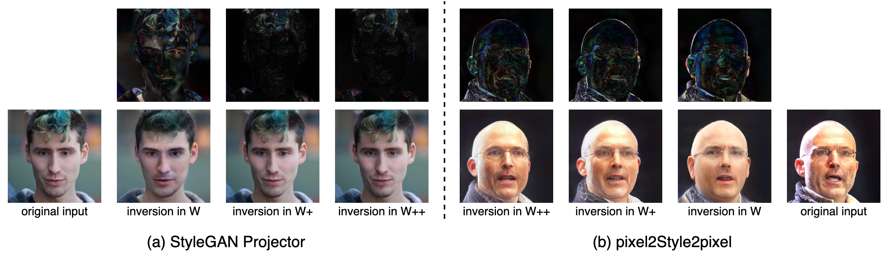
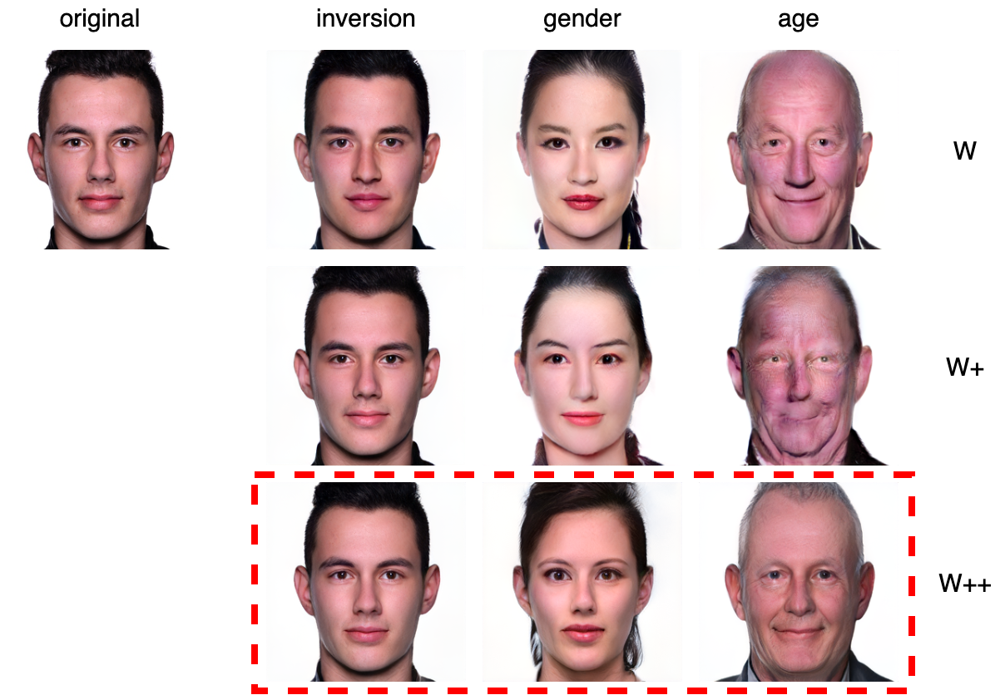
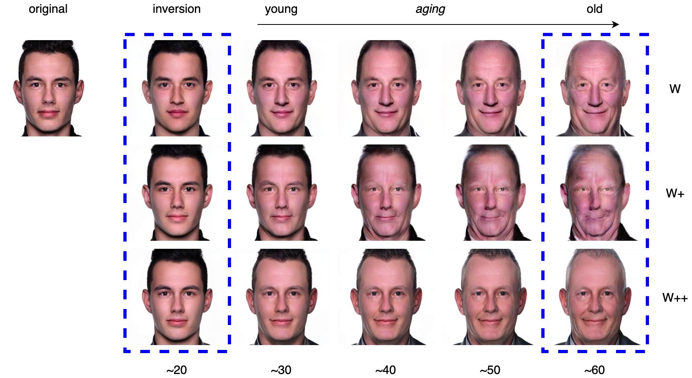
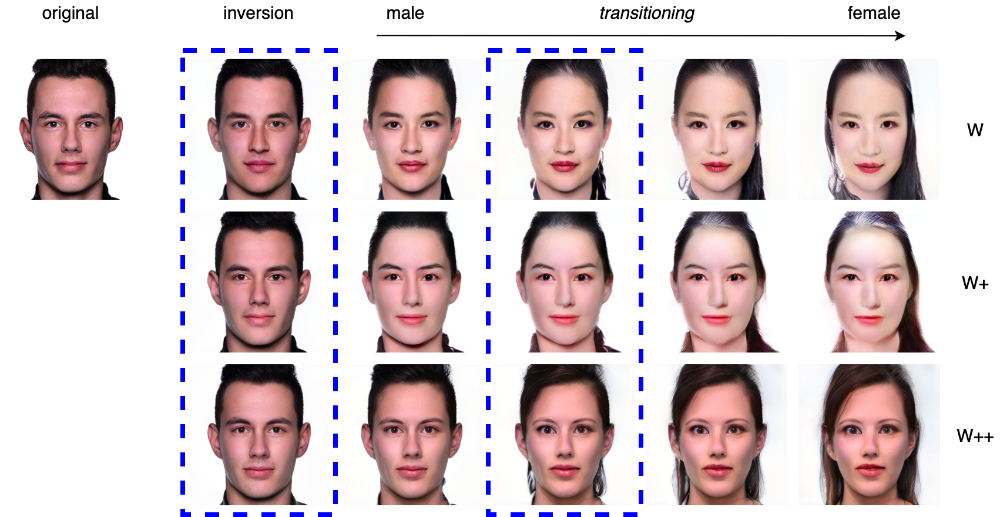
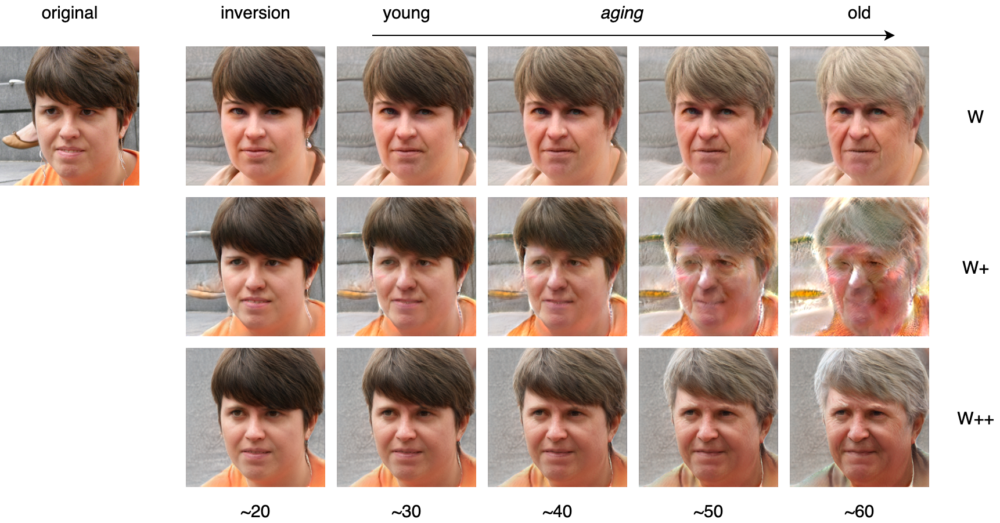

# Transforming the Latent Space of StyleGAN for Real Face Editing
Anonymous Author(s)

> Despite recent advances in semantic manipulation using StyleGAN, semantic editing of real faces remains challenging. The gap between the W space and the W+ space demands an undesirable trade-off between reconstruction quality and editing quality. To solve this problem, we propose to expand the latent space by replacing fully-connected layers in the StyleGAN's mapping network with attention-based transformers. This simple and effective technique integrates the aforementioned two spaces and transforms them into one new latent space called W++. Our modified StyleGAN maintains the state-of-the-art generation quality of the original StyleGAN with moderately better diversity. But more importantly, the proposed W++ space achieves superior performance in both reconstruction quality and editing quality. Despite these significant advantages, our W++ space supports existing inversion algorithms and editing methods with only negligible modifications thanks to its structural similarity with the W/W+ space. Extensive experiments on the FFHQ dataset prove that our proposed W++ space is evidently more preferable than the previous W/W+ space for real face editing.

<p align="center">

<br>
(a) Model overview. While the original StyleGAN feeds the same style code to each convolution layer, we redesign the architecture of the StyleGAN mapping network using Transformer so that different style codes are provided to different layers. We illustrate the structure for resolution at 256x256. 
<br>
(b) An illustration of our proposed mapping network. We omit some standard layers that are not essential for our architecture to not clutter the exposition.
</p>

## Results

### Image Synthesis

| Model    | FID           | Precision  | Recall    | Density   | Coverage  |
| -------- |:-------------:| ----------:| ---------:| ---------:| ---------:|
| StyleGAN | 4.69          | **0.670**  | 0.430     | **1.278** | 0.955     |
| Ours     | **4.67**      | 0.662      | **0.454** | 1.261     | **0.961** |

### Real Face Inversion

<p align="center">

<br>
(a) Qualitative comparison on image reconstruction with StyleGAN projector in different latent spaces. 
<br>
(b) Qualitative comparison on image reconstruction with pSp encoder in different latent spaces. 
<br>
Top row displays differences between inverted images and original images.
</p>

#### 1. StyleGAN projector

| Metrics    | Inversion in W  | Inversion in W+ | inversion in W++ |
| ---------: | ---------------:| ---------------:| ----------------:|
| Perceptual | 0.2079 ± 0.0389 | 0.0855 ± 0.0177 | 0.0937 ± 0.0179  |
| MSE        | 0.0776 ± 0.0512 | 0.0217 ± 0.0179 | 0.0255 ± 0.0183  |

#### 2. pSp

| Metrics    | Inversion in W  | Inversion in W+ | inversion in W++ |
| ---------: | ---------------:| ---------------:| ----------------:|
| Perceptual | 0.4158 ± 0.0590 | 0.3557 ± 0.0517 | 0.3641 ± 0.0530  |
| MSE        | 0.0661 ± 0.0298 | 0.0398 ± 0.0204 | 0.0412 ± 0.0204  |


### Real Face Editing
#### 1. InterfaceGAN

<p align="center">

<br>
Manipulating real faces with respect to the attribute age in different latent spaces. Given a real image to edit,  we first invert it back to the latent space using StyleGAN projector and then manipulate the latent code with InterFaceGAN. Our results (highlighted by the red box) achieve considerably stronger robustness for long-distance manipulation.
</p>

##### The intermediate frames of the entire Age Transformation and Gender Transitioning

<p align="center">

<br>
The age label for each image is created using the pre-trained DEX model. ~N denotes ``approximately N years old''. 
</p>

<p align="center">

<br>
</p>

##### More results on Age Transformation

<p align="center">

<br>
</p>

<p align="center">

<br>
</p>

##### More results on Gender Transitioning

<p align="center">

<br>
</p>

<p align="center">

<br>
</p>

#### 2. conditional GAN

<p align="center">

<br>
Our conditional GAN-based framework for editing real images. Here we cast one person's facial expression(<i>eyes open and mouth closed</i>) to another person.
</p>

<p align="center">

<br>
Manipulating real faces with respect to the attribute smile in different latent spaces. Given a real image to edit,  we first invert it back to the latent space using StyleGAN projector and then manipulate the latent code with our proposed cGAN-based editing pipeline. Our results (highlighted by the red box) exhibit the most apparent and natural smile expression.
</p>

##### More results on Smile

<p align="center">

<br>
</p>

<p align="center">

<br>
</p>

## Usage

### Training StyleGAN

```
num_gpus=8
path=/path/to/dataset
exp_name=styleganv2_transformer
batch=8
n_sample=64

python3 -m torch.distributed.launch --nproc_per_node=$num_gpus train.py \
--path $path \
--exp_name $exp_name \
--batch $batch \
--n_sample $n_sample
```

### Training StyleGAN projector

```
ckpt=./checkpoints/230000.pt
dataset=/path/to/dataset
output_dir=./inversion_w++

CUDA_VISIBLE_DEVICES=0 python3 projector.py \
--ckpt $ckpt \
--dataset $dataset \
--output_dir $output_dir
```

### Training pSp

```
dataset_type=ffhq_encode
exp_dir=./results_transformer
workers=8
batch_size=8
test_batch_size=8
test_workers=8
val_interval=2500
save_interval=5000
encoder_type=GradualStyleEncoder
lpips_lambda=0.8
l2_lambda=1
id_lambda=0.1

CUDA_VISIBLE_DEVICES=0 python pSp/scripts/train.py \
--dataset_type $dataset_type \
--exp_dir $exp_dir \
--workers $workers \
--batch_size $batch_size \
--test_batch_size $test_batch_size \
--test_workers $test_workers \
--val_interval $val_interval \
--save_interval $save_interval \
--encoder_type $encoder_type \
--start_from_latent_avg \
--lpips_lambda $lpips_lambda \
--l2_lambda $l2_lambda \
--id_lambda $id_lambda
```

### Testing pSp

```
exp_dir=./inversion_pSp_w++
checkpoint_path=./pSp/pretrained_models/best_model_w++.pt
data_path=./images
test_batch_size=1
test_workers=4

CUDA_VISIBLE_DEVICES=0 python pSp/scripts/inference.py \
--exp_dir $exp_dir \
--checkpoint_path $checkpoint_path \
--data_path $data_path \
--test_batch_size $test_batch_size \
--test_workers $test_workers \
--resize_outputs \
--couple_outputs
```

### Editing Age with InterfaceGAN

```
ckpt=./checkpoints/230000.pt
latent=/path/to/inverted/latents
output_dir=./editing_w++
num_sample=100000
batch_size=25
ratio=0.02
start_distance=-30
end_distance=30
steps=61

CUDA_VISIBLE_DEVICES=0 python3 edit_attribute.py \
--ckpt $ckpt \
--latent $latent \
--output_dir $output_dir \
--num_sample $num_sample \
--batch_size $batch_size \
--start_distance $start_distance \
--end_distance $end_distance \
--steps $steps \
--ratio $ratio
```

## Credits
**StyleGAN2 implementation:**  
https://github.com/rosinality/stylegan2-pytorch  
Copyright (c) 2019 Kim Seonghyeon  
License (MIT) https://github.com/rosinality/stylegan2-pytorch/blob/master/LICENSE  

**InterfaceGAN implementation:**  
https://github.com/genforce/interfacegan  
Copyright (c) 2019 Yujun Shen  
License (MIT) https://github.com/genforce/interfacegan/blob/master/LICENSE  

**pSp implementation:**  
https://github.com/eladrich/pixel2style2pixel  
Copyright (c) 2020 Elad Richardson, Yuval Alaluf  
License (MIT) https://github.com/eladrich/pixel2style2pixel/blob/master/LICENSE  

**DEX implementation:**  
https://github.com/siriusdemon/pytorch-DEX  

**prdc implementation:**  
https://github.com/clovaai/generative-evaluation-prdc  
Copyright (c) 2020-present NAVER Corp   
License (MIT) https://github.com/clovaai/generative-evaluation-prdc/blob/master/LICENSE.md  
